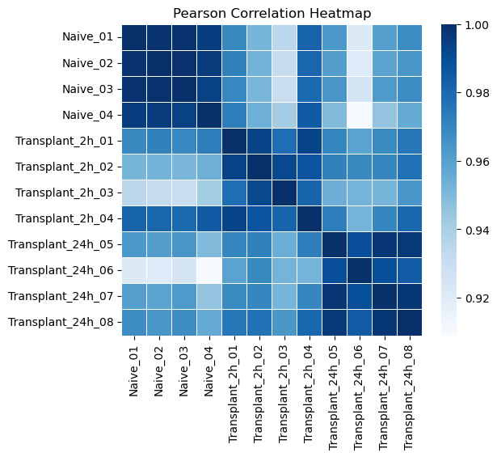
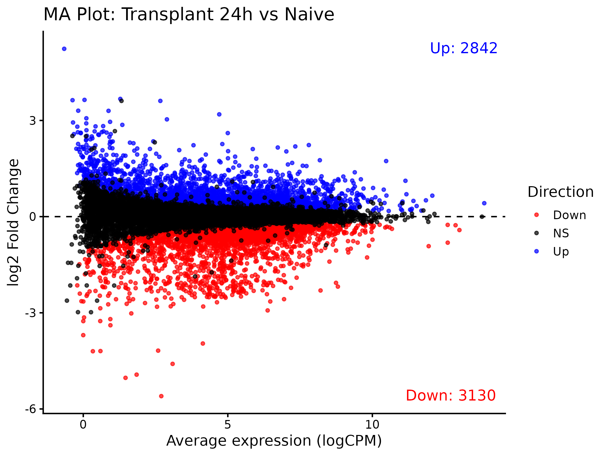

# RNA_seq_analysis

Recreation of Results from Koch, Clarissa M et al. “A Beginner's Guide to Analysis of RNA Sequencing Data.” American journal of respiratory cell and molecular biology vol. 59,2 (2018)

This repo contains data analysis in Python and R that tries to recreate the results from the paper. Plots after "Variance across groups" could not be recreated as the non-normalized raw count data is not avaliable. This was done for educational purposes and all of the data is credited to Koch et al..

All plots up to MA plots were written in Python, and can be found in `analysis.ipynb`, the MA plots in `analysis.rmd`.
The achieved results vary slightly from the original. PCR results show similar clustering, while having different explained variability, possibly caused by scaling method chosen (R in the paper? vs scikit standard scaler). Pearson’s correlation analysis seems identical, as data matched exactly.
Plots for low count threshold match the 1 RPKM cutoff seen in the paper. Scatterplots comparing the expression of individual genes between two samples also match.
Differentialy expressed genes were visualized in R, with the available data (all samples only), are located in `sample_data`.

Example plots:

